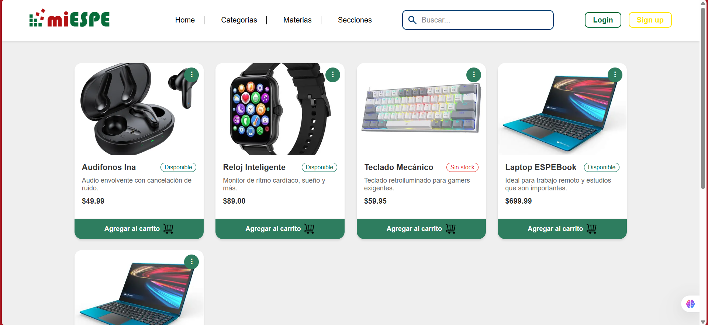

# 🛍️ ESPE-commerce

ESPE-commerce es una aplicación web orientada a mostrar productos en línea y permitir la autenticación de usuarios. Está construida utilizando Web Components personalizados desarrollados con LitElement.

## 📦 Estructura del Proyecto
```
src/
├── components/
│ ├── espe-header.ts
│ ├── espe-footer.ts
│ ├── espe-login.ts
│ ├── espe-product-card.ts
│ ├── espe-search-input.ts
│ ├── index.css
├── assets/
│ ├── imágenes de productos (.png, .jpg)
│ ├── logos de pago (visa.png, paypal.png, etc.)
├── products.json
├── indexFull.html
├── login.html
```

## ⚙️ Componentes Personalizados

### 🧩 `espe-header`
Encabezado principal del sitio. Contiene logo, navegación y buscador incrustado por medio de un `<slot>`.

### 🔐 `espe-login-card`
Componente de autenticación que permite iniciar sesión. Emiten eventos personalizados (`login-submit`) para manejar credenciales.

### 🔍 `espe-search-input`
Barra de búsqueda que ofrece sugerencias. Emite los eventos `sugerencia-seleccionada` y `buscar-enter` para interactuar con los productos.

### 📦 `espe-product-card`
Tarjetas reutilizables que muestran información de productos. Se cargan dinámicamente desde un archivo JSON y se filtran mediante el buscador.

### 🧱 `espe-footer`
Pie de página del sitio, mostrando logos, contactos y direcciones institucionales.

## 🔄 Funcionamiento

- Los productos se cargan desde `products.json` al iniciar la app.
- El buscador permite filtrar las tarjetas según coincidencia en el título o descripción.
- El login redirige al usuario a `indexFull.html` si las credenciales son válidas.
- Si no hay coincidencias de búsqueda, se muestra un mensaje de “No se encontraron productos”.

## 🌐 Enlaces de Navegación

- `login.html`: página inicial de autenticación
- `indexFull.html`: vista principal de productos y navegación

## 🛠️ Tecnologías Usadas

- LitElement (Web Components)
- HTML, CSS
- JavaScript / ES Modules
- JSON para datos simulados

---

## 🖼️ Vista completa del proyecto



💡 Si vas a expandir el proyecto con una API en Spring Boot, podrías incluir la lógica de autenticación con JWT y un endpoint para los productos para que se carguen desde el backend dinámicamente.

¿Quieres que te ayude a escribir una versión en inglés o agregar instrucciones para contribuir desde Git? También puedo ayudarte a estructurar tu rama en GitHub con convenciones de nombres y versionado.