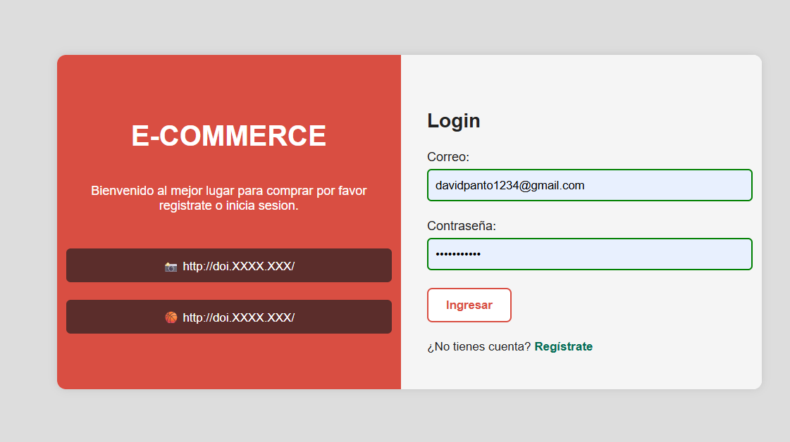
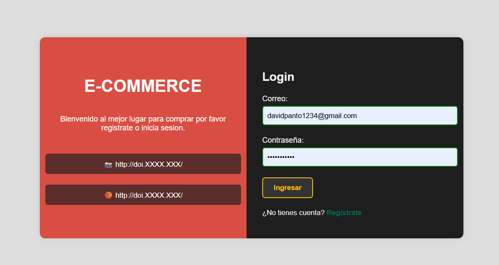

# 🧩 Componente Web: `<espe-login>`

Este componente Web desarrollado con [Lit](https://lit.dev/) representa una tarjeta de **inicio de sesión (Login)** para aplicaciones de tipo e-commerce o sistemas administrativos. 

Incluye diseño responsive y soporte automático para **tema claro/oscuro**, inputs para correo y contraseña, y la emisión de un evento personalizado con los datos ingresados.

---

## ✨ Características

- Interfaz dividida en dos columnas (información + formulario).
- Diseño adaptable a `prefers-color-scheme: dark`.
- Inputs para correo y contraseña.
- Evento personalizado `login-submit` con los datos del formulario.
- Estilo coherente con la paleta de la marca (colores definidos por CSS variables).

---

## 📦 Instalación

1. Clona este repositorio o copia el archivo `EspeLogin.js` dentro de tu proyecto.

2. Importa el componente en tu HTML:

```html
<script type="module" src="./EspeLogin.js"></script>
```

🧪 Uso
Agrega la etiqueta personalizada en tu HTML:

```html
<espe-login></espe-login>
```
Escucha el evento login-submit para obtener los datos del formulario:

```html
<script>
  const loginCard = document.querySelector('espe-login');
  loginCard.addEventListener('login-submit', (e) => {
    const { email, password } = e.detail;
    console.log('Login recibido:', email, password);
    // Aquí puedes enviar los datos al backend o validarlos
  });
</script>
```

## 🎯 Evento emitido
Evento	Detalles enviados (detail)
login-submit	{ email: string, password: string }

## 🌗 Tema oscuro
El componente se adapta automáticamente al modo oscuro del sistema operativo gracias a prefers-color-scheme: dark.

## 📸 Vista previa
- Vista clara	y oscura





## 📁 Estructura del componente
left → Columna informativa (branding, enlaces sociales).

right → Columna con formulario (inputs + botón).

handleSubmit() → Captura inputs y emite evento login-submit.

## ✅ To Do
 Validación visual de campos vacíos

 Soporte para autenticación externa (Google, GitHub)

 Estilos configurables desde atributos

## 🔒 Licencia
MIT © 2025 — Desarrollado por Andrés Pantoja.

