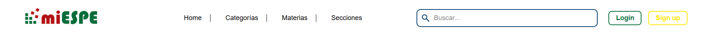

# 📚 Componente Web: `<espe-header>`

Componente web reutilizable desarrollado con [LitElement](https://lit.dev/) que representa la barra de navegación principal de una aplicación. Diseñado para ser altamente personalizable, accesible y adaptable a distintos contextos de uso, como portales institucionales, plataformas educativas o sistemas de gestión.

---

## Motivación

El componente `<espe-header>` nace con el objetivo de ofrecer una solución modular y desacoplada para encabezados de aplicaciones web. Su diseño busca:

- Separar responsabilidades visuales y funcionales.
- Facilitar la integración con otros componentes como buscadores o menús dinámicos.
- Mantener una estética profesional alineada con la identidad institucional.

---

## Características

- Visualización de logotipo institucional.
- Navegación dinámica mediante enlaces configurables.
- Slot para insertar un buscador u otro contenido personalizado.
- Botones de acción para login y registro.
- Estilos responsivos y personalizables mediante variables CSS.

---

## Instalación

Asegúrate de tener un entorno compatible con módulos ES y LitElement. Luego importa el componente:

```ts
import './src/components/espe-header.ts';
```
---

# Uso básico

```html
<espe-header
  logoSrc="https://srvcas.espe.edu.ec/authenticationendpoint/images/Logo-MiESPE.png"
  loginUrl="/login"
  signupUrl="/register"
>
  <espe-search-input slot="search"></espe-search-input>
</espe-header>
```

# Funcionamiento del  `<espe-header>`

El componente <espe-header> actúa como una barra de navegación modular y adaptable, mientras que <espe-search-input> se acopla perfectamente en su interior como un buscador interactivo. Juntos, forman una cabecera institucional moderna, responsiva y funcional, ideal para portales académicos o administrativos.

- El header recibe dinámicamente las categorías de navegación y muestra botones de acción.
- El buscador ofrece sugerencias en tiempo real y dispara eventos personalizados para filtrar contenido.
- Todo está encapsulado con LitElement, lo que garantiza rendimiento, reutilización y estilo aislado.

---

# Fragmentos claves del codigo 

## Inyección dinámica de categorías

```js
const header = document.getElementById("headerBar");
header.categories = [
  { label: 'Home', link: '/' },
  { label: 'Categorías', link: '/categorias' },
  { label: 'Materias', link: '/materias' },
  { label: 'Secciones', link: '/secciones' }
];
```

## Captura de eventos del buscador

```js
search.addEventListener("sugerencia-seleccionada", (e) => {
  filtrar(e.detail.value);
});

search.addEventListener("buscar-enter", (e) => {
  search.loading = true;
  filtrar(e.detail.value);
  setTimeout(() => (search.loading = false), 1000);
});
```

---

# Integración con `<espe-search-input>`

El componente <espe-search-input> se integra perfectamente en el slot search del header. Permite búsquedas con sugerencias, soporte para temas claro/oscuro y eventos personalizados.

## Eventos emitidos por <espe-search-input>

| Evento                  | Descripción                                                             | 
|-------------------------|-------------------------------------------------------------------------|
| sugerencia-seleccionada | Se dispara al hacer clic en una sugerencia. Devuelve { value: string }. | 
| buscar-enter            | Se dispara al presionar Enter. Devuelve { value: string }.              | 

---

## Propiedades

| Propiedad  | Tipo   | Descripción                                    | Por defecto | 
|------------|--------|------------------------------------------------|-------------|
| logoSrc    | string | URL del logotipo a mostrar.                    | ' '          | 
| categories | Array  | Lista de objetos { label, link } para el menú. | [ ]          | 
| loginUrl   | string | URL del botón de inicio de sesión.             | '#'         | 
| signupUrl  | string | URL del botón de registro.                     | '#'         | 

---

# Personalización con CSS

Puedes sobrescribir las siguientes variables CSS para adaptar el diseño:
```css
espe-header {
  --header-bg: #ffffff;
  --header-text: #000000;
  --color-primary: #006935;
  --color-accent: #FFE700;
  --color-link: #000000;
  --color-divider: #000000;
}
```

---

# Diseño responsivo

El componente se adapta automáticamente a pantallas pequeñas:

- El layout se reorganiza verticalmente en max-width: 768px.
- Los elementos de navegación y acciones se apilan para mejorar la usabilidad móvil.
- El buscador se expande al 100% del ancho disponible.

---

# Accesibilidad

- Todos los enlaces incluyen aria-label para lectores de pantalla.
- El slot de búsqueda puede contener un input con aria-label="Campo de búsqueda".
- Se recomienda usar role="navigation" y aria-current="page" si se desea mejorar aún más la semántica.

---

# Ejemplo dinámico con JavaScript

```js
const header = document.querySelector('espe-header');
header.categories = [
  { label: 'Inicio', link: '/' },
  { label: 'Categorías', link: '/categorias' },
  { label: 'Materias', link: '/materias' },
  { label: 'Secciones', link: '/secciones' }
];
```

# Ejemplo visual

Figura 1. Vista del Encabezado Institucional con Navegación y Búsqueda

 
Nota: Elaboración propia (2025). El encabezado muestra el logotipo institucional "miESPE", enlaces de navegación como "Home", "Categorías", "Materias" y "Secciones", una barra de búsqueda con el texto "Buscar..." y botones de acción para "Login" y "Sign up". Esta estructura permite una navegación clara y accesible dentro del portal.

---

# Licencia
Este componente está desarrollado con fines educativos y puede adaptarse libremente para proyectos internos o institucionales.


¿Quieres que preparemos el siguiente README para `<espe-search-input>` o prefieres afinar este primero con una sección de eventos personalizados o pruebas?

